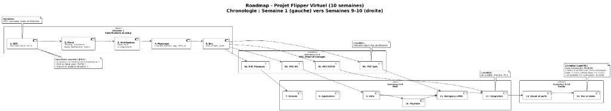

# Roadmap et questions ouvertes

## Planning

| Phase | Semaines | Objectif |
|-------|----------|----------|
| CDC + Setup | S1 | CDC validé, monorepo prêt, environnement et points d'avancement |
| POC | S2–S3 | Valider les choix techniques (physique, WebSockets, ESP32) |
| MVP | S4–S8 | Fonctionnalités cœur, architecture Domain → App → Infra, jeu jouable |
| Polish | S9–S10 | Visuel, perfs, livrable (code, README, vidéo, présentation, démo flipper + IoT) |

La roadmap s'étale sur 10 semaines : S1 cadre + monorepo ; S2–S8 POC puis MVP ; S9–S10 finalisation et livrable.

## Diagramme

## Questions ouvertes

- Protocole ESP32 à valider en POC : Serial ou WiFi pour les commandes et solénoïdes ?
