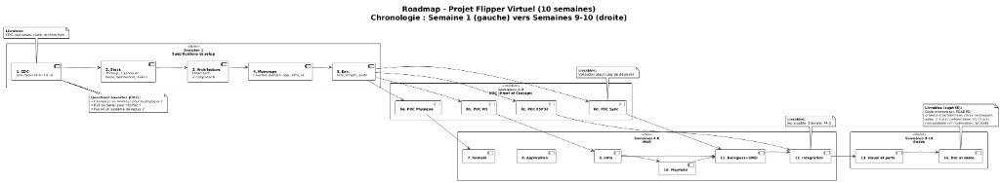

# Roadmap - Projet Flipper Virtuel

La roadmap du projet Flipper s’étale sur 10 semaines en trois blocs.

**Semaine 1** — On fixe le cadre (CDC, cas d’usage, stack technique, architecture) et on met en place le monorepo (domain, app, infra, UI) ainsi que l’environnement et les points d’avancement (vidéo, équipe).

**Semaines 2 à 8** — On valide les choix techniques avec des POC (physique, WebSockets, ESP32, IoT), puis on construit le MVP en suivant une architecture en couches (Domain → Application → Infra → Playfield, Backglass+DMD) et on intègre le tout pour avoir un jeu jouable.

**Semaines 9–10** — On finalise le visuel et les perfs, puis on livre (code, README, schéma d’architecture, choix techniques, vidéo 2–3 min, présentation 10–15 min et démo sur le flipper avec IoT/ESP).

---

## Diagramme

